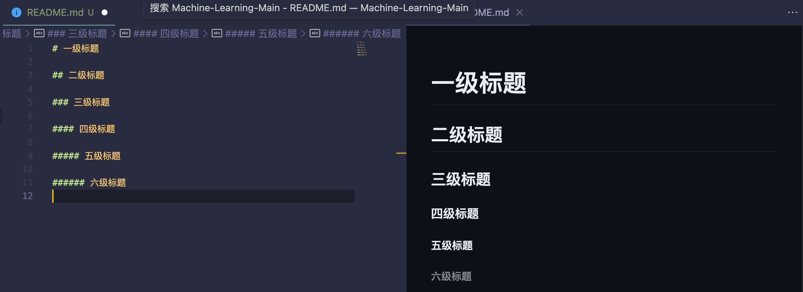
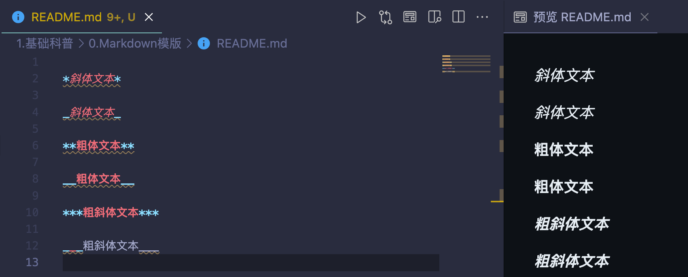

# Markdown模版

## 标题

1. **使用 = 和 - 标记一级和二级标题**

```markdown
我展示的是一级标题
=================

我展示的是二级标题
-----------------
```

**展示结果如下:**


2. **使用 # 号标记**
   使用 # 号可表示 1-6 级标题，一级标题对应一个 # 号，二级标题对应两个 # 号，以此类推。

```
# 一级标题
## 二级标题
### 三级标题
#### 四级标题
##### 五级标题
###### 六级标题
```

**展示结果如下:**


## 段落格式

### 字体

**Markdown 可以使用以下几种字体：**

```
*斜体文本*
_斜体文本_
**粗体文本**
__粗体文本__
***粗斜体文本***
___粗斜体文本___
```



### 分隔线

**你可以在一行中用三个以上的星号、减号、底线来建立一个分隔线，行内不能有其他东西。你也可以在星号或是减号中间插入空格。下面每种写法都可以建立分隔线：**

```
***

* * *

*****

- - -

----------
```

**展示结果如下:**


### 删除线

**如果想要在段落的文字上添加删除线,只需要在文字的两端加上两个波浪线 `～～`**

```
RUNOOB.COM
GOOGLE.COM
~~BAIDU.COM~~
```

**展示结果如下:**


### 下划线

**下划线是通过HTML的 `<u>`来实现的**

```
<u>带下划线文本</u>
```


### 脚注

脚注是对文本的补充说明。
Markdown 脚注的格式如下:
`[^要注明的文本]`
**用法:**

```
## Markdown 增加文献引用

这边文章是介绍如何在 Markdown 中增加文献引用。[<sup>1</sup>](#refer-anchor-1)

## 参考

<div id="refer-anchor-1"></div>

- [1] [百度学术](http://xueshu.baidu.com/)

<div id="refer-anchor-2"></div>

- [2] [Wikipedia](https://en.wikipedia.org/wiki/Main_Page)
```

**演示效果:**


